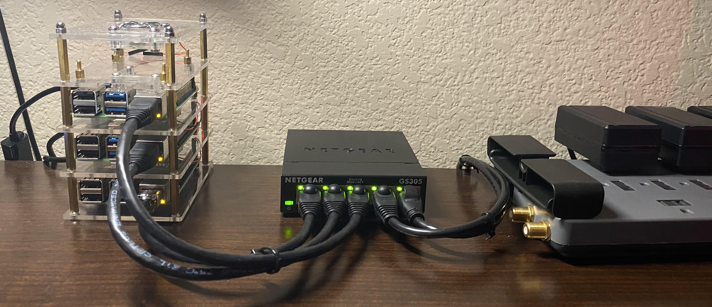
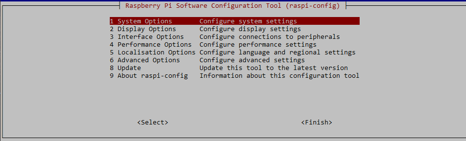
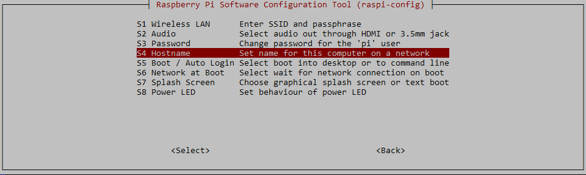
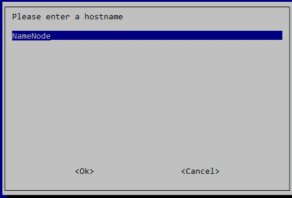
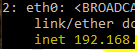
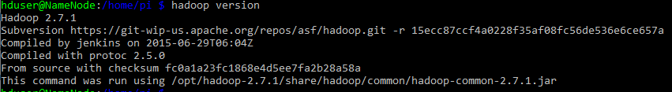

# Data-Extraction-and-Analysis-System
## Hardware Required

For cost effectiveness I purchased three Canakits which come with everything you need to set up the Raspberry Pi cluster:

[Canakit](https://www.amazon.com/gp/product/B07V5JTMV9/ref=ppx_yo_dt_b_search_asin_title?ie=UTF8&psc=1)

   * pi version 4, 4GB
   * Micro Sd memory card
   * power supply
   * heatsinks

You can use the included case but I opted for a cluster case by Geek Pi:

[GeekPi cluster case](https://www.amazon.com/gp/product/B07MW3GM1T/ref=ppx_yo_dt_b_search_asin_title?ie=UTF8&psc=1)

You can set up the Pi headless using WiFi, but for stability I opted to hardwire the cluster. You will need a network switch if your cluster is not going to be near a router with sufficient ports. If you plan on scaling this project up in the future to more than four Pis a larger switch could be a justified purchase. An unmanged switch is fine for this purpose and I opted for a 5 port switch:

[Netgear 5 Port Switch](https://www.amazon.com/gp/product/B07S98YLHM/ref=ppx_yo_dt_b_search_asin_title?ie=UTF8&psc=1)

You will need ethernet cables to connect the Pi's to the switch. You can purchase patch cables or build your own (I opted to make my own custom sizes to keep the build clean looking). Patch cables will work well for this if not making your won. 



## Enabling SSH, Connecting to the Cluster, Initial Setup
For this project there will be three Raspberry Pi version 4 micro computers set up in a cluster. One name node and two data nodes. The following is the process for setting up the Pis headlessly (no need for periphereals, i.e. monitor or keyboard).

### 1. Navigate to [Raspberry Pi OS Installer](https://www.raspberrypi.org/software/).

  * Download the Raspberry Pi OS installer for your desired OS.
         
  * Insert the micro sd card that will be used in your pi into your PC.
         
  * From the program menu select the Raspberry Pi OS, then the intended drive
  
### 2. After flashing the OS image to the micro sd card:

   * Remove the card from the PC and reinsert. If you do not do this the drive will show as Fat32 and you wont be able to see the root directory.
         
   * Now create a blank text file in the **_root_** directory of the sd card and name it **_ssh_**.
   
### 3. SSH into the Pis:

   * To connect fromm windows, open a command prompt window and type ssh pi@raspberrypi, your initial password is raspberry. 
   
   * I recommend downloading VNC viewer to go in and set up your desktop for each pi and do the initial configuration/ password changes. 
   * Once connected to the pi at the terminal type:
  ```console
        sudo raspi-config
  ```
  * This should bring up the following interfact where you will select option 1 System Options.
  
  
  
  Then go to option 54 Hostname
  
  
   
   * You can rename your pi to whatever you want, personally I named them for their function and started with the bottom pi in my rack as NameNode, then DataNode1, DataNode2, ...... That way if a node goes out you can easily swap in a new node and know its location. 
   
   
  
  
  * While in the menu if you plan on using VNC viewer for the desktop, I had to change the resolution in this configuration menu to get it to display. 

## Setting up the NameNode

### 1. Creating a New Group and User

* Type the following commands:
```console
  sudo addgroup hadoop
  sudo adduser --ingroup hadoop hduser
```
* Set the password to whatever you like, but write it down.
* No need to fill out the information of hduser, you can press enter and leave all fields blank.
* Everything Hadoop is going to happen via this newly created user so change to it by typing:
```console
  su hduser
```
### 2. Generating an SSH Key

* Change to your root directory:
```console
  cd ~
```
* Make a new directory:
``` Console
  mkdir .shh
```
* Generate the SSH key
``` Console
  ssh-keygen -t rsa -P ""
```
* Press enter to save the key to the default path /home/hduser/.ssh/id_rsa
* Concatenate the public key and store in an authorized keys directory with the following command:
``` Console
  cat ~/.ssh/id_rsa.pub > ~/.ssh/authorized_keys
```
* You can verify the preceeding step by typing:
``` Console
  ssh localhost
```
* Connection should establish, type exit to disconnect

### 3. Update Hosts

* To reiterate from early, pick uniform names for your Pis. NameNode is the master, DataNode1 .... DataNodeN are you slaves. 
* At this point you need to go through your own networks method of assigning static ip address to the Pis. Once you have done this you need to reboot each pi. 
``` Console
  sudo reboot
```
* After the reboot verify the Pis have the correct assigned ip address you picked by typing:
``` Console
  ip address
```
Highlighted in yellow is the start of your ipaddress. The whole address is not show in my image for security reasons:



* Now that you know the static IP adresses of your Pis it is time to update the hosts:
Type:
``` Console
  sudo nano /etc/hosts
```
Your Hosts should resemble this, by inserting your own IP address where there is an * :

```
  #/etc/hosts
  127.0.0.1       localhost
  ::1             localhost ip6-localhost ip6-loopback
  ff02::1         ip6-allnodes
  ff02::2         ip6-allrouters

  192.168.*.*    NameNode
  192.168.*.*    DataNode1
  192.168.*.*    DataNode2

```
### 4. Installing Hadoop
* Java was not included with the Raspbian OS so we need to download it. Due to the version of Hadoop I am choosing to run we need JDK 8. Any version different than JDK 8 will cause conflicts when setting up Hadoop.

``` Console
  sudo apt update
  sudo apt install openjdk-8-jdk
```

* For the purposes of this project I am using a stable, archived, version of Hadoop to avoid any conflicts. 

``` Console
  wget https://archive.apache.org/dist/hadoop/core/hadoop-2.7.1/hadoop-2.7.1.tar.gz
  cd ~
  sudo tar -xvzf hadoop-.2.7.1.tar.gz -C /opt/
  cd /opt
  sudo chown -R hduser:hadoop hadoop-2.7.1/
```
* Techinally Hadoop is installed at this point, but there is a lot of configuration left to do.
### 5. Setting environment Variables

* Best way to set the environment vaibles is to modify the ./bashrc file:

``` Console
  nano ./bashrc
```
* At the end of the file you are going to add the following lines for Hadoop:

```
# Hadoop
export JAVA_HOME=$(readlink -f /usr/lib/jvm/java-8-openjdk-armhf | sed "s:jre/bin/java::")
export HADOOP_HOME=/opt/hadoop-2.7.1
export HADOOP_MAPRED_HOME=$HADOOP_HOME
export HADOOP_COMMON_HOME=$HADOOP_HOME
export HADOOP_COMMON_LIB_NATIVE_DIR=$HADOOP_HOME/lib/native
export HADOOP_OPTS="$HADOOP_OPTS -Djava.library.path=$HADOOP_HOME/lib"
export HADOOP_HDFS_HOME=$HADOOP_HOME
export HADOOP_CONF_DIR=$HADOOP_HOME/etc/hadoop
export YARN_HOME=$HADOOP_HOME
export YARN_CONF_DIR=$HADOOP_HOME/etc/hadoop
export PATH=$PATH:$HADOOP_HOME/bin:$HADOOP_HOME/sbin

  # Suppress message: "WARN util.NativeCodeLoader: Unable to load
  # native-hadoop library for your platform... using builtin-java
  # classes where applicable"

# Hadoop Warning Suppression
export HADOOP_HOME_WARN_SUPPRESS=1
export HADOOP_ROOT_LOGGER="WARN,DRFA"
```
* For the following line:
```
  export JAVA_HOME=$(readlink -f /usr/lib/jvm/java-8-openjdk-armhf | sed "s:jre/bin/java::")
```
* /usr/lib/jvm/java-8-openjdk-armhf is going to be your directory location for java. 
* Any type you update the bashrc file you need to source it for the changes to take effect.

``` Console
  source ~./bashrc
```
* If everything went correctly you should be able to see the version of Hadoop installed:

``` Console
  hadoop version
```
* With an expected output of:



### Configuring Hadoop 2.7.1

* First step is to hard code the path to our Java installation for Hadoop in the *hadoop-env.sh* file
